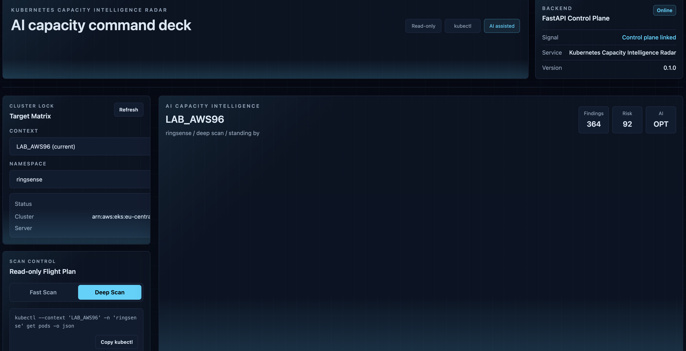
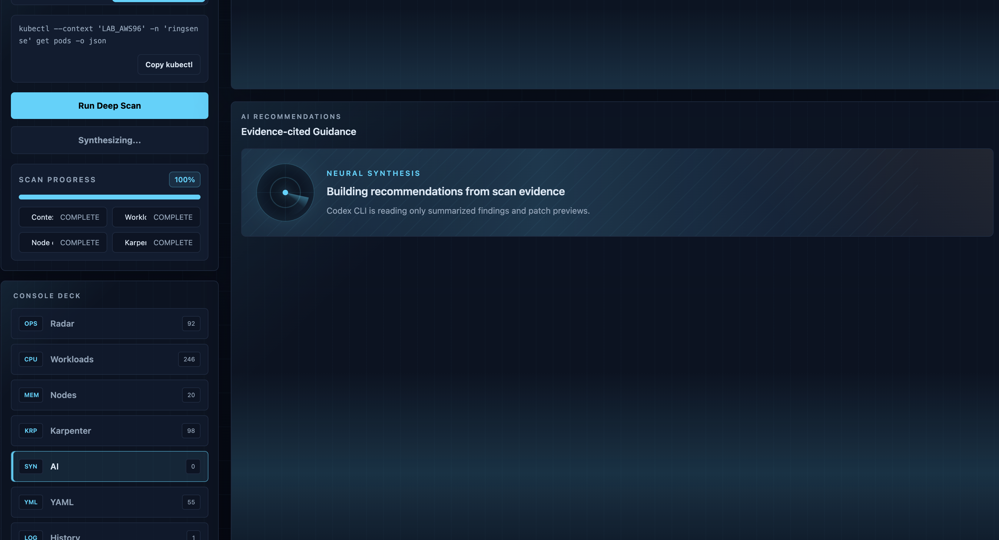
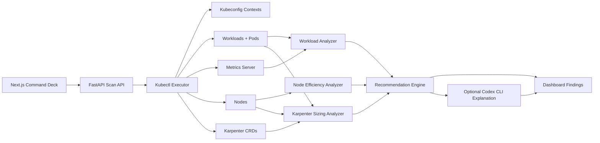

# Kubernetes Capacity Intelligence Radar

An AI-native, read-only Kubernetes capacity radar for finding resource waste, reliability risk, and Karpenter sizing issues from local kubeconfig contexts.

The project uses `kubectl` as the collection layer, deterministic analyzers as the source of truth, and an optional Codex CLI layer to explain findings in plain platform-engineering language.

The important boundary: **the app recommends, but it does not mutate the cluster.**

## What It Does

Kubernetes Capacity Intelligence Radar is designed for platform and DevOps engineers who want a quick answer to:

- Where are workloads missing CPU or memory requests?
- Which workloads are missing limits?
- Which pods show OOMKilled, restart-heavy, pending, or crashlooping behavior?
- Which namespaces carry the highest waste or reliability risk?
- Which nodes are empty, underused, overpacked, or close to memory pressure?
- Are Karpenter NodePools flexible enough for real scheduling demand?
- Are NodeClaims healthy, drifted, old, expired, or not ready?
- What right-sizing actions should be reviewed first?

It turns scattered `kubectl` commands into a single capacity review workflow.

## Screenshots

### Capacity Command Deck



### AI Recommendation Synthesis



## Product Principles

| Principle | Meaning |
| --- | --- |
| `kubectl` native | The backend shells out to `kubectl`; it does not use the Kubernetes Python SDK. |
| Read-only first | Scans inspect cluster state and never run `kubectl apply`. |
| Evidence before AI | Findings come from deterministic analyzers before AI sees anything. |
| AI is optional | The dashboard still works when `AI_PROVIDER` is empty. |
| Human-reviewed changes | YAML is generated only as a patch preview for review. |
| Secret-aware output | Command output is sanitized before being returned or summarized. |

## Radar Model

The project organizes cluster health into five signal groups:

| Signal Group | Questions Answered |
| --- | --- |
| Context | Is the selected kubeconfig context reachable, and what server version is running? |
| Workloads | Are requests, limits, restarts, OOMs, pending pods, and crashloops under control? |
| Usage | Do live CPU and memory metrics suggest over-requesting, under-requesting, or idle workloads? |
| Nodes | Are nodes efficiently packed, low-utilization, memory pressured, or overloaded with pods? |
| Karpenter | Are NodePools, NodeClaims, requirements, limits, disruption settings, and capacity types healthy? |

Each signal becomes structured findings, recommendations, and optional patch previews.

## Architecture



### Backend Layers

| Layer | Responsibility |
| --- | --- |
| API routes | Health, context discovery, workload scan, node scan, Karpenter scan, AI explain. |
| Kubectl executor | Builds safe commands, applies context/kubeconfig, handles timeouts, sanitizes output. |
| Scanners | Collect Kubernetes JSON and live metrics using read-only commands. |
| Analyzers | Convert raw objects into risk and waste signals. |
| Recommendation engine | Produces practical next actions and YAML previews. |
| AI explainer | Uses Codex CLI only when configured, with strict JSON output. |

### Frontend Surfaces

| Surface | Purpose |
| --- | --- |
| Target Matrix | Select kubeconfig context and namespace. |
| Scan Control | Run fast or deep scans and copy the equivalent `kubectl` command. |
| Radar | Show overall risk, workload waste, node pressure, and Karpenter signal counts. |
| Workloads | List missing requests/limits, restarts, OOM risk, and namespace waste. |
| Nodes | Show node request ratios, live usage, pressure, and density findings. |
| Karpenter | Inspect NodePools, NodeClaims, limits, flexibility, and sizing recommendations. |
| AI | Generate evidence-cited summaries from scan output. |
| YAML | Review patch previews without applying them. |

## Scan Modes

### Fast Scan

Fast scan focuses on workload posture:

1. Verify context reachability.
2. Read namespaces and workload controllers.
3. Read pods.
4. Attempt pod metrics if metrics-server is available.
5. Produce workload and namespace findings.

### Deep Scan

Deep scan expands into capacity and Karpenter:

1. Run fast scan.
2. Read nodes and scheduled pods.
3. Attempt node metrics.
4. Discover Karpenter resources.
5. Analyze NodePools and NodeClaims.
6. Generate capacity recommendations and patch previews.

## Findings

Every finding is intended to be actionable and evidence-backed.

```json
{
  "severity": "high",
  "namespace": "production",
  "workload_name": "api",
  "workload_kind": "Deployment",
  "container_name": "api",
  "finding_type": "missing_memory_request",
  "evidence": "container api has no memory request",
  "recommendation": "Set a memory request based on observed usage or a conservative baseline."
}
```

Supported workload findings include:

- Missing CPU request
- Missing memory request
- Missing CPU limit
- Missing memory limit
- OOMKilled container
- High restart count
- Pending pod
- CrashLoopBackOff pod
- Over-requested CPU
- Over-requested memory
- Under-requested memory
- Possible OOM risk
- Idle workload

Supported node findings include:

- Empty node
- Low-utilization node
- Node near memory pressure
- High pod density

Supported Karpenter findings include:

- NodePool not ready
- Missing or risky NodePool limits
- Narrow instance requirements
- Single capacity type
- Missing spot option where appropriate
- Missing consolidation
- Aggressive disruption settings
- NodeClaim not ready
- Drifted NodeClaim
- Expired or old NodeClaim
- Pending pod that does not match any NodePool

## Karpenter Capacity Review

The Karpenter analyzer is focused on capacity design, not generic troubleshooting.

It reviews:

- NodePool readiness conditions
- CPU and memory limits
- disruption and consolidation settings
- instance families and categories
- capacity types such as spot and on-demand
- zone and architecture flexibility
- NodeClaim readiness, drift, age, expiry, and instance type
- pending pods that fail NodePool matching

Recommendations can include:

- Widen instance family constraints.
- Allow multiple zones.
- Add spot capacity where workload risk permits.
- Tune consolidation and disruption settings.
- Adjust NodePool CPU and memory limits.
- Split specialized workloads into separate NodePools.
- Align pod selectors, affinities, and tolerations.
- Right-size workload requests before changing NodePool size.

## Optional AI Explanation

AI is deliberately placed after deterministic analysis.

When disabled:

```json
{
  "enabled": false,
  "error": "AI is disabled. Set AI_PROVIDER=codex_cli to enable explanations."
}
```

When enabled, the backend sends only summarized scan findings to Codex CLI and expects this strict JSON response:

```json
{
  "executive_summary": "",
  "top_risks": [],
  "top_savings_opportunities": [],
  "karpenter_recommendations": [],
  "workload_rightsizing_recommendations": [],
  "yaml_patch_previews": [],
  "confidence": 0,
  "assumptions": []
}
```

The AI layer must:

- cite evidence from the scan payload
- avoid inventing facts
- preserve uncertainty in assumptions
- generate patch previews only
- never apply changes

## API Surface

```text
GET  /health
GET  /contexts
GET  /contexts/{context_name}/namespaces
POST /scan/context
POST /scan/workloads
POST /scan/nodes
POST /scan/karpenter
POST /ai/explain
```

## Environment

```env
KUBECONFIG_PATH=
KUBECTL_TIMEOUT_SECONDS=60
AI_PROVIDER=
AI_TIMEOUT_SECONDS=180
AI_MAX_FINDINGS=20
CODEX_CLI_PATH=codex
```

Enable optional Codex CLI explanations:

```env
AI_PROVIDER=codex_cli
CODEX_CLI_PATH=/Applications/Codex.app/Contents/Resources/codex
```

## Repository Layout

```text
AI-K8s-Capacity-Radar/
├── README.md
├── LICENSE
├── .env.example
├── screenshots/
│   ├── capacity-command-deck.png
│   └── ai-recommendations-synthesizing.png
├── docs/
│   ├── architecture.md
│   ├── scan-flow.md
│   └── karpenter-analysis.md
└── prompts/
    ├── 01-project-setup-prompt.md
    ├── 02-kubectl-scanner-prompt.md
    ├── 03-capacity-analysis-engine-prompt.md
    ├── 04-karpenter-ai-recommendation-prompt.md
    ├── 05-end-to-end-dashboard-prompt.md
    ├── ai-explanation-system-prompt.md
    ├── scan-summary-prompt.md
    └── yaml-patch-guidelines.md
```

## Safety Boundaries

This project should not:

- run `kubectl apply`
- delete or patch live cluster resources
- send raw secrets to AI
- require AI for core scan results
- hide missing metrics or partial scan warnings

This project should:

- make every recommendation traceable to evidence
- continue when metrics-server is unavailable
- return friendly errors for kubeconfig, RBAC, timeout, and reachability issues
- keep YAML changes as human-reviewed previews

## Why This Exists

Kubernetes capacity work is usually split across several surfaces: workload specs, live metrics, node utilization, scheduling failures, and autoscaler configuration. This radar puts those signals in one place and keeps the remediation path safe.

The goal is not to replace platform engineers. The goal is to give them a faster, evidence-backed starting point for capacity reviews.
