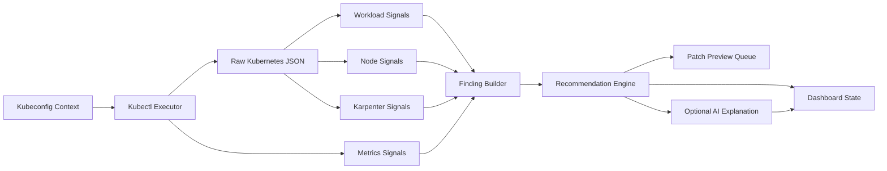

# Radar Architecture

Kubernetes Capacity Intelligence Radar is built as a read-only capacity review loop. It does not try to become a cluster operator. It observes cluster state, turns that state into capacity signals, and presents evidence-backed recommendations for a platform engineer to review.

The design has three hard boundaries:

- `kubectl` is the only Kubernetes collection mechanism.
- deterministic analyzers produce the source-of-truth findings.
- AI can explain findings, but it cannot create facts or mutate the cluster.

## Signal Pipeline



## Runtime Shape

| Area | Role |
| --- | --- |
| Next.js command deck | Lets an engineer choose a context, run scans, compare signals, and copy advisory commands or YAML. |
| FastAPI control plane | Owns scan orchestration, response contracts, warnings, and AI explanation requests. |
| Kubectl executor | Runs read-only subprocess commands with kubeconfig, context, timeout, stderr capture, and secret-aware sanitization. |
| Static analyzers | Detect missing requests, missing limits, pending pods, crash loops, OOMs, restart pressure, and risky namespaces. |
| Metrics analyzers | Use metrics-server output when available to compare requests, limits, and live usage. |
| Node analyzer | Measures requested capacity, live utilization, pod density, pressure signals, and empty or low-use nodes. |
| Karpenter analyzer | Reviews NodePools, NodeClaims, requirements, limits, capacity types, disruption settings, and pending pod fit. |
| Recommendation engine | Converts findings into practical next actions and YAML patch previews. |
| AI explainer | Produces an evidence-cited executive summary only when `AI_PROVIDER=codex_cli`. |

## Collection Contract

The backend treats every `kubectl` call as an unreliable external dependency. Each command returns a structured result instead of throwing raw process output into the UI.

```json
{
  "status": "success",
  "stdout": "{}",
  "stderr": "",
  "return_code": 0,
  "error": null,
  "timed_out": false
}
```

That contract lets scans degrade cleanly. For example, if `kubectl top nodes` fails because metrics-server is unavailable, the node scan still returns static capacity analysis with a warning.

## Scan Domains

### Context

Context discovery answers whether a kubeconfig context is available and reachable. It collects the context name, cluster name, user name, current-context marker, and server version when reachable.

### Workloads

Workload scanning reads pods, deployments, statefulsets, daemonsets, and namespaces as JSON. It identifies resource hygiene issues and pod health signals before live metrics are considered.

### Usage

Usage scanning is optional because metrics-server is optional in Kubernetes clusters. When available, live pod and node metrics are used to estimate over-requesting, under-requesting, idle workloads, and memory risk.

### Nodes

Node scanning joins node allocatable resources with scheduled pod requests and limits. This produces requested CPU and memory percentages, live usage percentages, pod density, and low-utilization signals.

### Karpenter

Karpenter discovery checks for NodePool, NodeClaim, and EC2NodeClass resources. If Karpenter is absent, the scan returns `enabled: false` and the rest of the dashboard continues.

When present, the analyzer looks for sizing and flexibility issues rather than generic cluster errors.

## Failure Behavior

The system should return a useful dashboard state for partial scans. Expected failure cases include:

- `kubectl` is not installed
- kubeconfig path is missing or invalid
- selected context is unreachable
- command timeout
- RBAC permission denied
- metrics-server unavailable
- Karpenter CRDs not installed
- namespace has no workloads
- large clusters return too much data for an AI prompt

Failures become warnings or scoped scan errors whenever possible. A failed optional signal should not erase successful findings from other signals.

## AI Boundary

AI receives a summarized scan payload, not raw cluster dumps. The prompt asks it to behave like a senior Kubernetes platform engineer and return strict JSON:

- executive summary
- top risks
- savings opportunities
- Karpenter recommendations
- workload right-sizing recommendations
- YAML patch previews
- confidence
- assumptions

The AI output is advisory. It must cite scan evidence, preserve uncertainty, and avoid inventing cluster state.

## Safety Model

The app can recommend:

- request and limit changes
- safer workload baselines
- NodePool flexibility improvements
- consolidation tuning
- capacity limit adjustments
- selector, affinity, and toleration alignment

The app must not:

- run `kubectl apply`
- patch or delete cluster resources
- remediate automatically
- send raw secrets to AI
- hide partial scan failures

This keeps the project useful for real clusters without crossing into unattended automation.
